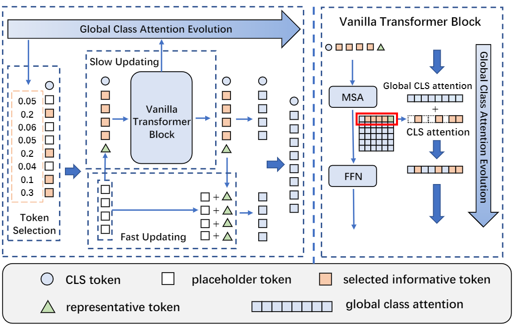

# Evo-ViT: Slow-Fast Token Evolution for Dynamic Vision Transformer

This repository contains PyTorch training code for Evo-ViT: Slow-Fast Token Evolution for Dynamic Vision Transformer.

This work proposes to accelerate vanilla vision transformers of both flat and deep-narrow structures without additional pre-training and fine-tuning. 
# Preparation
Download and extract ImageNet train and val images from http://image-net.org/. The directory structure is the standard layout for the torchvision datasets.ImageFolder, and the training and validation data is expected to be in the train/ folder and val folder respectively.
```
/path/to/imagenet/
  train/
    class1/
      img1.jpeg
    class2/
      img2.jpeg
  val/
    class1/
      img3.jpeg
    class/2
      img4.jpeg
```
All distillation settings are conducted with a teacher model RegNetY-160, which is available at [checkpoint](https://dl.fbaipublicfiles.com/deit/regnety_160-a5fe301d.pth).

Install the requirements by running:
```
pip3 install -r requirements.txt
```
NOTE: all experiments in the paper are conducted under cuda11.0. The torch and torchvision installation packages with cuda11.0 are available at:
[torch1.7.0-cu110](https://download.pytorch.org/whl/cu110/torch-1.7.0%2Bcu110-cp36-cp36m-linux_x86_64.whl), 
[torchvision-0.8.1-cu110](https://download.pytorch.org/whl/cu110/torchvision-0.8.1%2Bcu110-cp36-cp36m-linux_x86_64.whl)


# Usage

## Training with input resolution of 224
To train Evo-ViT  on ImageNet on a single node with 8 gpus for 300 epochs,  run:

Evo-ViT-T
```
python3 -m torch.distributed.launch --nproc_per_node=8 --use_env main_deit.py --model evo_deit_tiny_patch16_224 --drop-path 0 --batch-size 256 --data-path /path/to/imagenet --output_dir /path/to/save
```

Evo-ViT-S
```
python3 -m torch.distributed.launch --nproc_per_node=8 --use_env main_deit.py --model evo_deit_small_patch16_224 --batch-size 128 --data-path /path/to/imagenet --output_dir /path/to/save
```

Evo-ViT-B
```
python3 -m torch.distributed.launch --nproc_per_node=8 --use_env main_deit.py --model evo_deit_base_patch16_224 --batch-size 128 --data-path /path/to/imagenet --output_dir /path/to/save
```

To train Evo-LeViT-192  on ImageNet on a single node with 8 gpus for 300 epochs,  run:
```
python3 -m torch.distributed.launch --nproc_per_node=8 --use_env main_levit.py --model EvoLeViT_192 --batch-size 256 --data-path /path/to/imagenet --output_dir /path/to/save
```
The other models of Evo-LeViT are trained with the same command as mentioned above.

## Training with input  resolution of 384

To train Evo-ViT-B*  on ImageNet on 2 nodes with 8 gpus each for 300 epochs, run:
```
python3 -m torch.distributed.launch --nproc_per_node=8 --nnodes=$NODE_SIZE  --node_rank=$NODE_RANK --master_port=$MASTER_PORT --master_addr=$MASTER_ADDR main_deit.py --model evo_deit_base_patch16_384 --input-size 384 --batch-size 64 --data-path /path/to/imagenet --output_dir /path/to/save
```

To train Evo-ViT-S*  on ImageNet on a single node with 8 gpus for 300 epochs,  run:
```
python3 -m torch.distributed.launch --nproc_per_node=8 --use_env main_deit.py --model evo_deit_small_patch16_384 --batch-size 128 --input-size 384 --data-path /path/to/imagenet --output_dir /path/to/save"
```

Evo-ViT-T*  is trained with the same command as Evo-ViT-S*.

To train Evo-LeViT-384*  on ImageNet on a single node with 8 gpus for 300 epochs,  run:

```
python3 -m torch.distributed.launch --nproc_per_node=8 --use_env main_levit.py --model EvoLeViT_384_384 --input-size 384 --batch-size 128 --data-path /path/to/imagenet --output_dir /path/to/save
```

The other models of Evo-LeViT* are trained with the same command of Evo-LeViT-384*.

## Testing inference throughput
To test inference throughput, first modify the model name in line 153 of benchmark.py. Then, run:
```
python3 benchmark.py
```

